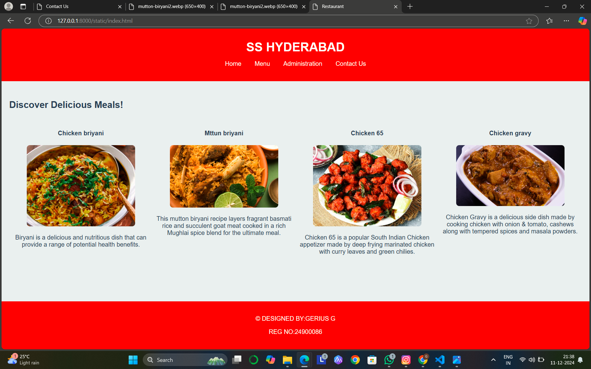
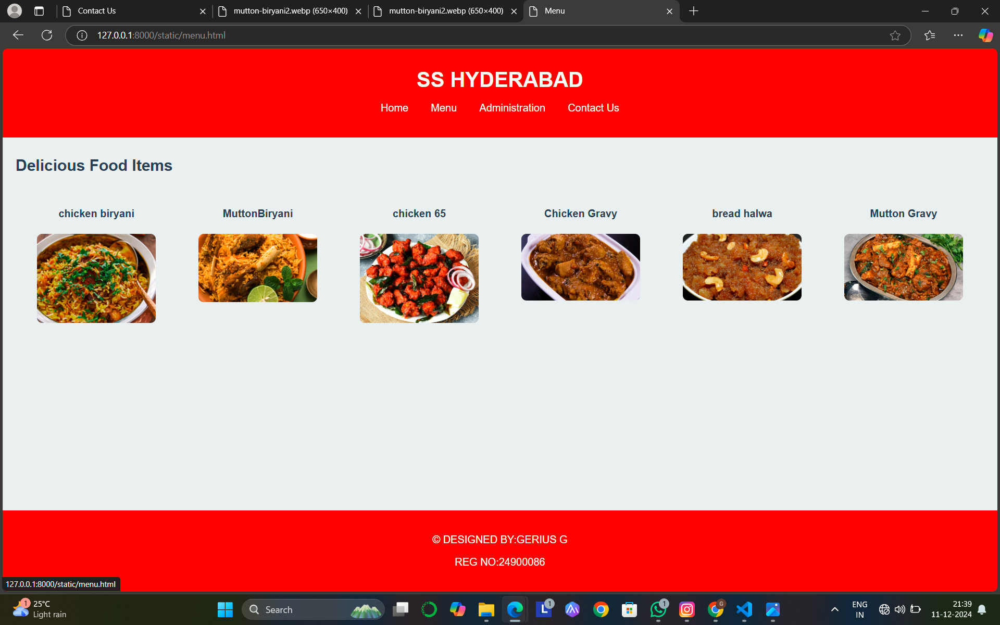
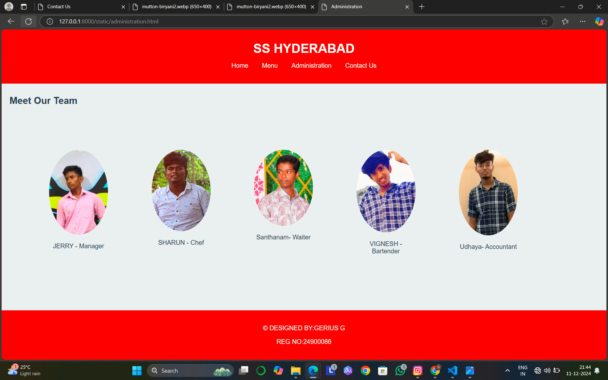
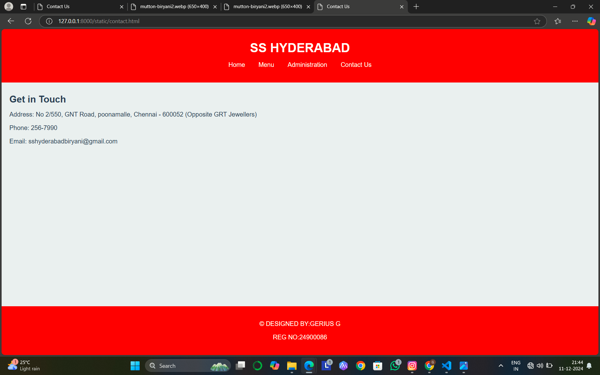

# Ex.07 Restaurant Website
## Date:11/12/2024

## AIM:
To develop a static Restaurant website to display the food items and services provided by them.

## DESIGN STEPS:

## Step 1:
Requirement collection.

## Step 2:
Creating the layout using HTML and CSS.

## Step 3:
Updating the sample content.

## Step 4:
Choose the appropriate style and color scheme.

## Step 5:
Validate the layout in various browsers.

## Step 6:
Validate the HTML code.

## Step 7:
Publish the website in the given URL.

# PROGRAM:
```

index.html

<!DOCTYPE html>
<html lang="en">
<head>
    <meta charset="UTF-8">
    <meta name="viewport" content="width=device-width, initial-scale=1.0">
    <link rel="stylesheet" href="style.css">
    <title>Restaurant</title>
</head>
<body>
    <div class="container">
        <header>
            <h1>SS HYDERABAD</h1>
            <nav>
                <ul>
                    <li><a href="index.html">Home</a></li>
                    <li><a href="menu.html">Menu</a></li>
                    <li><a href="administration.html">Administration</a></li>
                    <li><a href="contact.html">Contact Us</a></li>
                </ul>
            </nav>
        </header>
        <main>
            <br>
            <h2>Discover Delicious Meals!</h2>
            <section class="menu-items">
            <br>  
                <div class="food-item">
                    <h4>Chicken briyani</h4>
                    
                    
                    <p>Biryani is a delicious and nutritious dish that can provide a range of potential health benefits. </p>
                </div>
                <div class="food-item">
                    <h4>Mttun briyani</h4>
                    
                    
                    <p>This mutton biryani recipe layers fragrant basmati rice and succulent goat meat cooked in a rich Mughlai spice blend for the ultimate meal.</p>
                </div>
                <div class="food-item">
                    <h4>Chicken 65</h4>
                    
                    
                    <p>Chicken 65 is a popular South Indian Chicken appetizer made by deep frying marinated chicken with curry leaves and green chilies.</p>
                </div>
                <div class="food-item">
                    <h4>Chicken gravy</h4>
                    
                    
                    <p>Chicken Gravy is a delicious side dish made by cooking chicken with onion & tomato, cashews along with tempered spices and masala powders.</p>
                </div>
            </section>
        </main>
        
        
        <footer>
            <p>© DESIGNED BY:GERIUS G</p>
            <p>REG NO:24900086</p>
        </footer>
    </div>
</body>
</html>

menu.html

<!DOCTYPE html>
<html lang="en">
<head>
    <meta charset="UTF-8">
    <meta name="viewport" content="width=device-width, initial-scale=1.0">
    <link rel="stylesheet" href="style.css">
    <title>Menu</title>
</head>
<body>
    <div class="container">
        <header>
            <h1>SS HYDERABAD</h1>
            <nav>
                <ul>
                    <li><a href="index.html">Home</a></li>
                    <li><a href="menu.html">Menu</a></li>
                    <li><a href="administration.html">Administration</a></li>
                    <li><a href="contact.html">Contact Us</a></li>
                </ul>
            </nav>
        </header>
        <main>
            <h2>Delicious Food Items</h2>
            <section class="menu-items">
                <div class="food-item">
                    <h4>chicken biryani</h4>
                    
                    
                </div>
                <div class="food-item">
                    <h4>MuttonBiryani</h4>
                    
                    
                </div>
                <div class="food-item">
                    <h4>chicken 65</h4>
                    
                    
                </div>
                <div class="food-item">
                    <h4>Chicken Gravy </h4>
                    
                    
                </div>
                <div class="food-item">
                    <h4>bread halwa</h4>
                    
                   
                </div>
                <div class="food-item">
                    <h4>Mutton Gravy</h4>
                    
                    
                </div>
                
            </section>
        </main>
        
        <footer>
            <p>© DESIGNED BY:GERIUS G</p>
            <p>REG NO:24900086</p>
        </footer>
    <div>
    
</body>
</html>

administration.html

<!DOCTYPE html>
<html lang="en">
<head>
    <meta charset="UTF-8">
    <meta name="viewport" content="width=device-width, initial-scale=1.0">
    <link rel="stylesheet" href="style.css">
    <title>Administration</title>
</head>
<body>
    <div class="container">
        <header>
            <h1>SS HYDERABAD</h1>
            <nav>
                <ul>
                    <li><a href="index.html">Home</a></li>
                    <li><a href="menu.html">Menu</a></li>
                    <li><a href="administration.html">Administration</a></li>
                    <li><a href="contact.html">Contact Us</a></li>
                </ul>
            </nav>
        </header>
        <main>
            <h2>Meet Our Team</h2>
            <div class="team">
                <div class="member">
                    
                    <p>JERRY - Manager</p>
                </div>
                <div class="member">
                    
                    <p>SHARUN - Chef</p>
                </div>
                <div class="member">
                    
                    <p>Santhanam- Waiter</p>
                </div>
                <div class="member">
                    
                    <p>VIGNESH - Bartender</p>
                </div>
                <div class="member">
                    
                    <p>Udhaya- Accountant</p>
                </div>
            </div>
        </main>
        <footer>
            <p>© DESIGNED BY:GERIUS G</p>
            <p>REG NO:24900086</p>
        </footer>

    </div>
    
</body>
</html>

contact.html

<!DOCTYPE html>
<html lang="en">
<head>
    <meta charset="UTF-8">
    <meta name="viewport" content="width=device-width, initial-scale=1.0">
    <link rel="stylesheet" href="style.css">
    <title>Contact Us</title>
</head>
<body>
    <div class="container">
        <header>
            <h1>SS HYDERABAD</h1>
            <nav>
                <ul>
                    <li><a href="index.html">Home</a></li>
                    <li><a href="menu.html">Menu</a></li>
                    <li><a href="administration.html">Administration</a></li>
                    <li><a href="contact.html">Contact Us</a></li>
                </ul>
            </nav>
        </header>
        <main>
            <h2>Get in Touch</h2>
            <p>Address: No 2/550, GNT Road, poonamalle, Chennai - 600052 (Opposite GRT Jewellers)</p>
            <p>Phone: 256-7990</p>
            <p>Email: sshyderabadbiryani@gmail.com </p>
        </main>
        <footer>
            <p>© DESIGNED BY:GERIUS G</p>
            <p>REG NO:24900086</p>
        </footer>

    </div>
    
</body>
</html>
```
# OUTPUT:






# RESULT:
The program for designing software company website using HTML and CSS is completed successfully.
